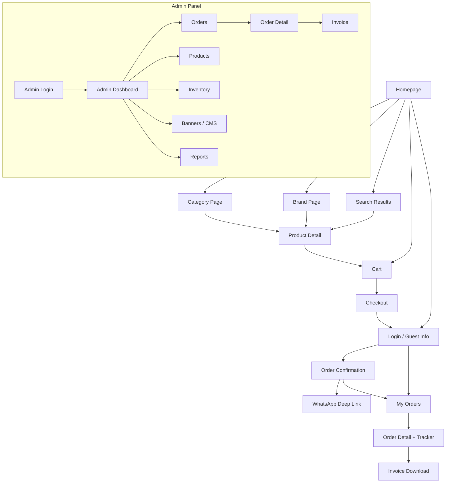
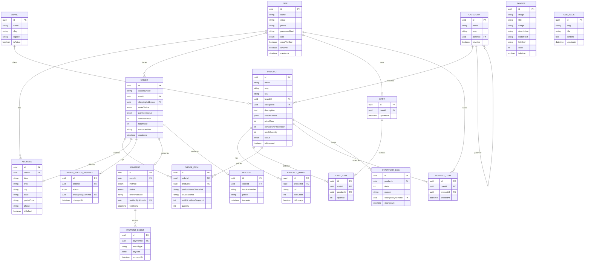
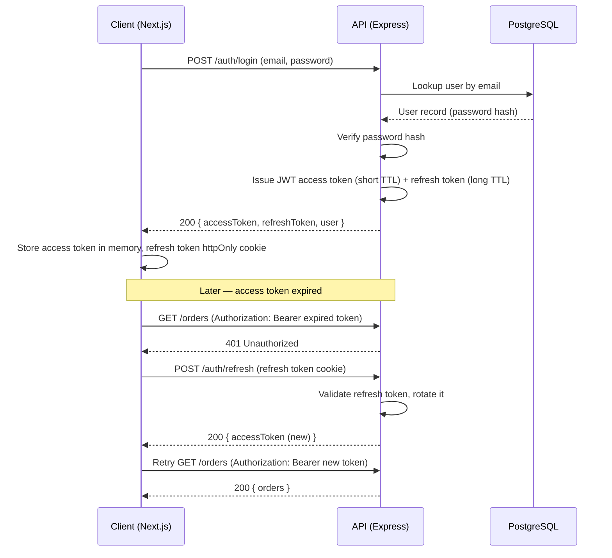
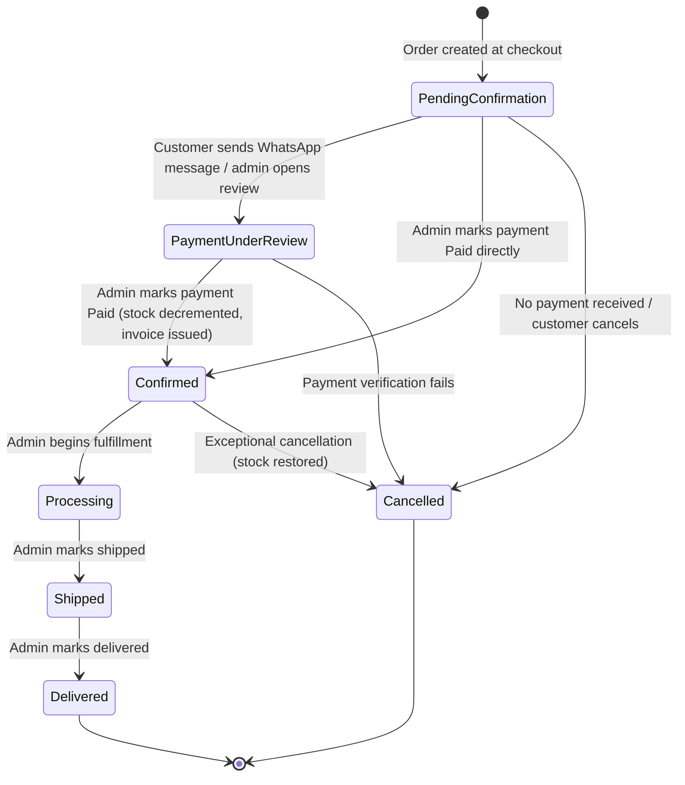
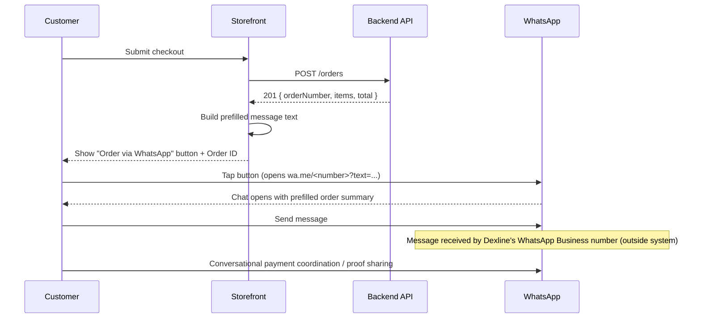
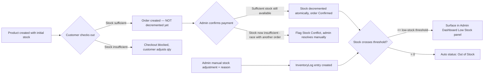
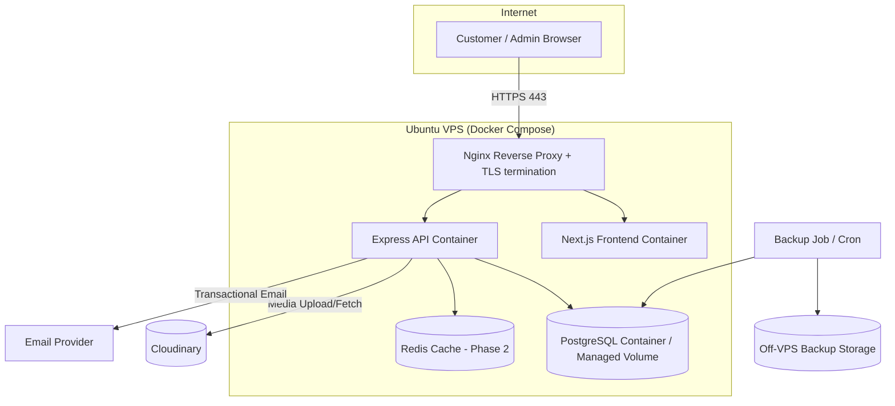
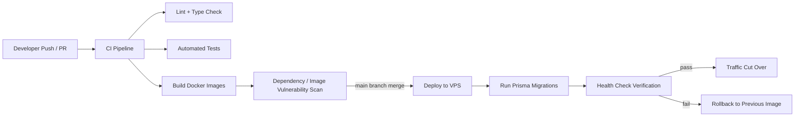

# Software Requirements Specification

## Dexline Store — E‑Commerce Platform

| | |
|---|---|
| **Document Type** | Software Requirements Specification (IEEE 830 / 29148‑informed) |
| **Product** | Dexline Store |
| **Version** | 1.0 |
| **Status** | Draft for Stakeholder Review |
| **Classification** | Internal / Confidential |
| **Prepared For** | Dexline Technologies |

---

## Document Control

| Version | Date | Author | Description |
|---|---|---|---|
| 0.1 | Draft cycle | Business Analysis Team | Initial structure and stakeholder input capture |
| 1.0 | Current | Business Analysis Team | First complete baseline for review |

**Review Cycle:** This document is a living baseline. Any change to scope, data model, or workflow described herein requires a version increment and stakeholder sign-off before development proceeds against it.

---

## Table of Contents

1. Introduction
2. Purpose
3. Scope
4. Definitions, Acronyms, and Abbreviations
5. Stakeholders
6. Business Objectives
7. Product Vision
8. User Personas
9. Assumptions
10. Constraints
11. Functional Requirements
12. Non-Functional Requirements
13. Business Rules
14. User Roles and Permissions
15. Complete User Journeys
16. Use Cases
17. User Stories with Acceptance Criteria
18. Wireframe Descriptions
19. Navigation Flow
20. Information Architecture
21. Database Design
22. Entity Relationship Diagram
23. PostgreSQL Table Design
24. Prisma Model Planning
25. API Specification
26. Authentication Flow
27. Authorization Matrix
28. Order Lifecycle
29. Payment Workflow
30. WhatsApp Ordering Workflow
31. Invoice Generation Workflow
32. Inventory Management Workflow
33. Reporting Requirements
34. Dashboard Requirements
35. Notification Requirements
36. SEO Requirements
37. Accessibility Requirements
38. Security Requirements
39. Performance Requirements
40. Scalability Considerations
41. Logging and Monitoring
42. Backup and Disaster Recovery
43. Deployment Architecture
44. Docker Deployment Strategy
45. VPS Infrastructure Design
46. CI/CD Strategy
47. Testing Strategy
48. Risks and Mitigations
49. Future Enhancements
50. Development Roadmap (MVP, Phase 2, Phase 3)

---

## 1. Introduction

Dexline Store is a commercial e-commerce platform being built for Dexline Technologies to sell computing, networking, and office-technology products online under a single-vendor, multi-brand model. The platform's defining characteristic is its **launch-phase order model**: rather than integrating a payment gateway on day one, Dexline Store generates a formal order record and hands the customer off to WhatsApp to complete the transaction conversationally, with an administrator manually reconciling payment before the order is confirmed. This document specifies the requirements for that platform end-to-end — from data model to deployment — in enough detail that engineering, QA, design, and DevOps can each work from it without requiring the original business conversation to be replayed.

This SRS is written for an audience that is technically fluent but does not share the business context. Every workflow chapter therefore states not only *what* happens but *why* the system is shaped that way, so implementers can make sound judgment calls in the many small decisions an SRS cannot fully anticipate.

## 2. Purpose

The purpose of this document is to:

- Define the complete functional and non-functional requirements of Dexline Store for its initial commercial release and near-term roadmap.
- Provide a single source of truth for engineering (frontend, backend, database), design, QA, and DevOps teams during implementation.
- Specify the data model, API surface, and infrastructure architecture in sufficient detail to begin implementation without further discovery.
- Establish the business rules governing the manual, WhatsApp-mediated order and payment workflow, and define the architectural seams required to later replace it with an automated payment gateway **without a system redesign**.
- Serve as the contractual basis for acceptance testing and stakeholder sign-off.

This document does not itself contain source code, UI mockup files, or infrastructure-as-code — it defines what those artifacts must satisfy.

## 3. Scope

### 3.1 In Scope (Release 1 — MVP)

- Public storefront: brand catalog, category catalog, product catalog, product detail, search, filtering.
- Customer accounts: registration, login, profile, address book, order history, wishlist.
- Shopping cart and WhatsApp-mediated checkout (no online payment gateway in MVP).
- Admin panel: brand, category, product, inventory, order, customer, and content (banner/CMS) management.
- Manual payment confirmation workflow and order status tracking.
- Auto-generated PDF invoices post payment confirmation.
- Core reporting and an operational admin dashboard.
- SEO foundation (server-rendered pages, structured data, sitemap).
- Dockerized deployment to a single Ubuntu VPS behind Nginx.

### 3.2 Out of Scope (Release 1)

- Online payment gateway integration (architected for, not implemented — see §29).
- Native mobile applications (iOS/Android).
- ERP / accounting system integration.
- Multi-vendor marketplace features (this is a single-vendor storefront).
- Multi-currency and multi-language storefronts (architecture should not preclude them; see §49).
- Loyalty/rewards programs, gift cards, subscriptions.

### 3.3 Product Perspective

Dexline Store is a new, self-contained system. It is not a plug-in to an existing storefront. It exposes a public REST API consumed by its own Next.js frontend today, and by future clients (mobile apps, ERP integrations) later — which is why API design in §25 is treated as a first-class, versioned public contract rather than an internal implementation detail.

## 4. Definitions, Acronyms, and Abbreviations

| Term | Definition |
|---|---|
| **SRS** | Software Requirements Specification |
| **SKU** | Stock Keeping Unit — unique identifier for a sellable product variant |
| **RBAC** | Role-Based Access Control |
| **JWT** | JSON Web Token |
| **PII** | Personally Identifiable Information |
| **CMS** | Content Management System (for static pages: About, Terms, Returns, etc.) |
| **MVP** | Minimum Viable Product — this document's Release 1 |
| **Manual Order** | An order confirmed by an administrator after verifying payment received outside the platform (bank transfer, cash, UPI, etc.), rather than via an automated gateway |
| **Admin** | A staff user of Dexline Technologies with elevated permissions in the platform |
| **Customer** | A registered or guest end-user purchasing products |
| **Brand** | A manufacturer/label under which products are sold (e.g., Dell, HP, Cisco) — distinct from Dexline Technologies itself, the vendor |
| **Category** | A hierarchical grouping used for navigation and filtering (e.g., Laptops → Business Laptops) |
| **Order Lifecycle** | The defined sequence of states an order passes through from creation to closure (§28) |
| **VPS** | Virtual Private Server |
| **ERD** | Entity Relationship Diagram |
| **ORM** | Object-Relational Mapper |

## 5. Stakeholders

| Stakeholder | Role | Primary Interest |
|---|---|---|
| Dexline Technologies (Business Owner) | Commissioning organization | Revenue, brand presentation, operational efficiency |
| Store Administrators | Internal staff, day-to-day operators | Usable tools for catalog, order, and payment management |
| Customers (B2C) | Individual buyers | Easy discovery, trustworthy checkout, order visibility |
| Business/Bulk Buyers (B2B-leaning) | Organizations purchasing IT equipment in volume | Accurate stock/specs, WhatsApp-based negotiation, reliable fulfillment |
| Development Team | Engineering | Clear, unambiguous, testable requirements |
| QA Team | Quality assurance | Verifiable acceptance criteria |
| DevOps/Infrastructure Team | Deployment and operations | Deployable, observable, recoverable system |
| Future Integration Partners | Payment gateways, ERP vendors | Stable API contracts and extension points |

## 6. Business Objectives

| # | Objective | Success Indicator |
|---|---|---|
| BO-1 | Launch a credible, professional online storefront for Dexline's IT/office/networking product range | Public launch with 60+ brands and full catalog live |
| BO-2 | Convert website interest into WhatsApp conversations without requiring payment infrastructure upfront | % of carts that reach "Order via WhatsApp" |
| BO-3 | Reduce administrative overhead in manually confirming and fulfilling orders | Average time from order creation to admin confirmation |
| BO-4 | Build a data foundation (customers, orders, products) that supports later automation | Data model requires no breaking migration when payment gateway is added |
| BO-5 | Establish SEO presence for organic, non-paid customer acquisition | Indexed pages, organic traffic growth post-launch |
| BO-6 | Keep the platform operable by a small internal team | Admin panel usable without engineering support for routine catalog/order tasks |

## 7. Product Vision

**For** Dexline Technologies' customers — individual and business buyers of computers, laptops, networking, and office equipment — **Dexline Store** is a modern e-commerce platform **that** presents a large multi-brand catalog with a fast, trustworthy browsing experience and converts interest into confirmed orders through a lightweight, human-verified checkout. **Unlike** generic marketplace storefronts, Dexline Store deliberately keeps a human (WhatsApp conversation, manual payment verification) in the loop during the trust-building phase of the business, while its underlying architecture is built so that step can be automated away later without disrupting customers, admins, or historical data.

The long-term vision (see §49–50) extends this into a fully self-service platform with integrated payments, richer B2B tooling, and multi-channel order intake, without ever requiring a ground-up rebuild.

## 8. User Personas

**Persona 1 — Priya, IT Procurement Executive (B2B-leaning Customer)**
Mid-30s, buys laptops and networking gear in batches of 5–20 units for her employer. Compares specs across brands, wants accurate stock counts and bulk pricing conversations. Prefers WhatsApp over long web forms — it's how she already talks to other vendors. Needs order history for expense reporting.

**Persona 2 — Arjun, Individual Buyer (B2C Customer)**
Late 20s, buying a single laptop or accessory for personal use. Price-sensitive, compares discounts, reads product images/specs carefully, checks out on mobile. Wants to trust that "manual payment" isn't a scam — needs clear order status and confirmation messaging.

**Persona 3 — Fatima, Store Administrator**
Dexline Technologies staff, manages the catalog and processes orders daily. Not a technical user. Needs an admin dashboard that surfaces "what needs my attention right now" (new orders, low stock, unverified payments) without digging through menus.

**Persona 4 — Rahul, Store Manager / Business Owner**
Wants a periodic, digestible view of sales, best-selling brands/categories, and inventory health, without needing to interpret raw data.

**Persona 5 — Dev, Future Integration Engineer**
Not a launch-day user, but a design constraint: whoever eventually wires up a payment gateway or ERP system must be able to do so against documented API and data model without reverse-engineering undocumented assumptions.

## 9. Assumptions

- Dexline Technologies has an active WhatsApp Business number that can receive customer messages.
- Payment verification (bank transfer, UPI, cash on account, etc.) happens outside the platform; the platform only records the outcome.
- Product content (images, specifications, brand logos) will be supplied or entered by Dexline staff via the admin panel.
- Initial traffic volumes are consistent with a regional/national single-vendor storefront, not global marketplace scale (see §40 for scale thresholds).
- Customers have access to WhatsApp on the device they check out from, or another device.
- English is the sole storefront language at launch.

## 10. Constraints

| # | Constraint | Impact |
|---|---|---|
| C-1 | No online payment gateway at launch | Checkout must terminate in a manual-confirmation workflow, not a payment form |
| C-2 | Single-vendor model | No multi-seller data model, commission logic, or seller onboarding |
| C-3 | Small internal admin team | Admin UX must minimize training needs; avoid workflows requiring technical knowledge |
| C-4 | Deployment target is a single Ubuntu VPS (not managed cloud PaaS) | Deployment and scaling design (§43–45) must work within self-managed infrastructure |
| C-5 | Fixed technology stack (Next.js/TypeScript, Node/Express, PostgreSQL/Prisma, Docker, Cloudinary) | Requirements and architecture must remain implementable on this stack; no requirement should presuppose a different stack |
| C-6 | Budget/timeline typical of a small commercial engagement | Roadmap (§50) phases scope rather than delivering everything at once |

## 11. Functional Requirements

Requirements use the ID scheme `FR-<MODULE>-<NNN>`. Priority: **M**ust have (MVP), **S**hould have (Phase 2), **C**ould have (Phase 3+).

### 11.1 Authentication

| ID | Requirement | Priority |
|---|---|---|
| FR-AUTH-001 | System shall allow customers to register with name, email, phone number, and password. | M |
| FR-AUTH-002 | System shall enforce password complexity (min. 8 characters, at least one letter and one number). | M |
| FR-AUTH-003 | System shall hash passwords using a strong one-way algorithm (bcrypt/argon2); plaintext passwords shall never be stored or logged. | M |
| FR-AUTH-004 | System shall issue a short-lived JWT access token and a long-lived refresh token on successful login. | M |
| FR-AUTH-005 | System shall support silent access-token renewal via the refresh token without forcing re-login. | M |
| FR-AUTH-006 | System shall allow refresh token revocation on logout ("logout everywhere" for Phase 2). | M / S |
| FR-AUTH-007 | System shall support password reset via emailed, time-limited reset link. | M |
| FR-AUTH-008 | System shall support guest checkout that creates a shadow customer record, upgradable to a full account. | S |
| FR-AUTH-009 | System shall lock or rate-limit login attempts after repeated failures to mitigate brute force. | M |
| FR-AUTH-010 | System shall support admin accounts with the same credential mechanics but a distinct `role` claim, never self-registrable from the public storefront. | M |
| FR-AUTH-011 | System shall support email verification for new customer accounts. | S |

### 11.2 Customer Management

| ID | Requirement | Priority |
|---|---|---|
| FR-CUST-001 | Customers shall be able to view and edit their profile (name, phone, email — email change requires re-verification). | M |
| FR-CUST-002 | Customers shall be able to maintain multiple saved shipping addresses with one marked default. | M |
| FR-CUST-003 | Customers shall be able to view their full order history with status and totals. | M |
| FR-CUST-004 | Customers shall be able to view a single order's detail, including line items, status timeline, and invoice download once available. | M |
| FR-CUST-005 | Customers shall be able to deactivate/request deletion of their account (data retained per §38 compliance rules). | S |
| FR-CUST-006 | Admins shall be able to view, search, and filter the customer list, and view a customer's full order/interaction history. | M |
| FR-CUST-007 | Admins shall be able to suspend a customer account (e.g., abuse, repeated non-payment). | S |

### 11.3 Admin Management

| ID | Requirement | Priority |
|---|---|---|
| FR-ADM-001 | System shall support multiple admin accounts, each assigned exactly one role (see §14). | M |
| FR-ADM-002 | A `Super Admin` role shall be able to create, edit, deactivate, and assign roles to other admin accounts. | M |
| FR-ADM-003 | Admin actions on orders, products, and inventory shall be attributable to the acting admin (audit trail, §41). | M |
| FR-ADM-004 | System shall prevent the last remaining Super Admin account from being deactivated or demoted. | M |

### 11.4 Brand Management

| ID | Requirement | Priority |
|---|---|---|
| FR-BRAND-001 | Admins shall be able to create, edit, and deactivate brands (name, logo, description, SEO slug). | M |
| FR-BRAND-002 | The system shall support at least 60 concurrently active brands without degradation to catalog browsing performance. | M |
| FR-BRAND-003 | Each product shall belong to exactly one brand. | M |
| FR-BRAND-004 | The storefront shall provide a "Shop by Brand" listing and a dedicated brand landing page showing that brand's products. | M |
| FR-BRAND-005 | Brand logos shall be stored via Cloudinary and served with responsive, optimized variants. | M |
| FR-BRAND-006 | Deactivating a brand shall hide its products from the storefront without deleting historical order data referencing them. | M |

### 11.5 Category Management

| ID | Requirement | Priority |
|---|---|---|
| FR-CAT-001 | Admins shall be able to create, edit, and deactivate categories in a hierarchical (parent/child) structure. | M |
| FR-CAT-002 | A category tree shall support at least 3 levels of depth (e.g., Computers → Laptops → Business Laptops). | M |
| FR-CAT-003 | Each product shall belong to exactly one leaf category. | M |
| FR-CAT-004 | The storefront navigation shall render the category tree, and category pages shall include their descendant products. | M |
| FR-CAT-005 | Deleting a category with active products shall be blocked; admin must reassign products first. | M |

### 11.6 Product Management

| ID | Requirement | Priority |
|---|---|---|
| FR-PROD-001 | Admins shall be able to create, edit, deactivate, and delete (soft-delete) products. | M |
| FR-PROD-002 | Product records shall include: name, SKU, brand, category, description, specifications (structured key/value), price, compare-at (original) price, stock quantity, status, and SEO metadata. | M |
| FR-PROD-003 | System shall auto-generate a unique, URL-safe slug from product name, with admin override. | M |
| FR-PROD-004 | System shall support marking a product as "Featured"/"Best Seller" for homepage promotion. | M |
| FR-PROD-005 | System shall support product status: Draft, Active, Out of Stock, Discontinued. | M |
| FR-PROD-006 | System shall support full-text search across product name, brand, description, and SKU. | M |
| FR-PROD-007 | Storefront shall support filtering by category, brand, price range, and availability, and sorting by price/newest/popularity. | M |
| FR-PROD-008 | System shall support simple product variants (e.g., RAM/storage configuration) as Phase 2. | S |
| FR-PROD-009 | System shall compute and display discount percentage when compare-at price exceeds price. | M |

### 11.7 Product Images

| ID | Requirement | Priority |
|---|---|---|
| FR-IMG-001 | Admins shall be able to upload multiple images per product (min. 1, recommended up to 8). | M |
| FR-IMG-002 | Images shall be uploaded to Cloudinary and referenced by secure URL; local disk storage shall not be used in production. | M |
| FR-IMG-003 | Admins shall be able to reorder images and designate one as primary (used in listings/cards). | M |
| FR-IMG-004 | System shall validate uploaded file type (jpeg/png/webp) and enforce a maximum file size. | M |
| FR-IMG-005 | System shall serve responsive image variants (thumbnail, card, full) via Cloudinary transformations. | M |
| FR-IMG-006 | Admins shall be able to remove individual product images. | M |

### 11.8 Inventory

| ID | Requirement | Priority |
|---|---|---|
| FR-INV-001 | Each product shall track an integer stock quantity. | M |
| FR-INV-002 | Stock shall decrement automatically upon **order confirmation** (payment verified), not at cart or checkout time, to avoid over-reservation on unpaid orders (see §32). | M |
| FR-INV-003 | System shall prevent checkout submission for a quantity exceeding available stock at time of order creation, with a soft (short-lived) reservation to reduce race conditions. | M |
| FR-INV-004 | Admins shall be able to manually adjust stock with a required reason note, generating an audit entry. | M |
| FR-INV-005 | System shall flag products at or below a configurable low-stock threshold on the admin dashboard. | M |
| FR-INV-006 | System shall auto-set product status to "Out of Stock" when quantity reaches zero, and revert to "Active" when restocked. | M |

### 11.9 Shopping Cart

| ID | Requirement | Priority |
|---|---|---|
| FR-CART-001 | Customers (registered or guest) shall be able to add, update quantity, and remove products from a cart. | M |
| FR-CART-002 | Cart contents shall persist across sessions for registered customers (server-side) and across page reloads for guests (client-side, merged into account on login). | M |
| FR-CART-003 | Cart shall display line totals and a running subtotal, recalculated on any change. | M |
| FR-CART-004 | System shall validate stock and current pricing at checkout time and surface any discrepancy before order creation. | M |

### 11.10 Wishlist

| ID | Requirement | Priority |
|---|---|---|
| FR-WISH-001 | Registered customers shall be able to add/remove products to a persistent wishlist. | S |
| FR-WISH-002 | Customers shall be able to move a wishlist item directly into the cart. | S |

### 11.11 Orders

| ID | Requirement | Priority |
|---|---|---|
| FR-ORD-001 | System shall create an order record from cart contents on checkout submission, generating a unique, human-readable Order ID (e.g., `DXL-2026-000123`). | M |
| FR-ORD-002 | Order record shall snapshot product name, SKU, unit price, and quantity at time of order (immutable even if the product later changes). | M |
| FR-ORD-003 | System shall capture shipping address, contact phone, and optional order note at checkout. | M |
| FR-ORD-004 | System shall set new orders to status `Pending Confirmation` (see §28) and shall not decrement stock at this point. | M |
| FR-ORD-005 | System shall present a "Order via WhatsApp" action post-order-creation that opens WhatsApp with a pre-filled message containing the Order ID and summary (§30). | M |
| FR-ORD-006 | Customers shall be able to view all their orders with current status. | M |
| FR-ORD-007 | Admins shall be able to view, search, and filter all orders by status, date range, customer, and payment state. | M |
| FR-ORD-008 | System shall prevent editing of an order's line items once created; corrections require admin-initiated cancellation and a new order. | M |

### 11.12 Order Tracking

| ID | Requirement | Priority |
|---|---|---|
| FR-TRACK-001 | Every order status change shall be recorded with timestamp and acting admin, forming a visible timeline. | M |
| FR-TRACK-002 | Customers shall see a linear status tracker on their order detail page (§28 states). | M |
| FR-TRACK-003 | System shall notify the customer (email at minimum) on each significant status transition. | M |

### 11.13 Payment Status

| ID | Requirement | Priority |
|---|---|---|
| FR-PAY-001 | Orders shall carry an independent `paymentStatus` field (`Unpaid`, `Payment Under Review`, `Paid`, `Refunded`) distinct from fulfillment `orderStatus`. | M |
| FR-PAY-002 | Admins shall be able to mark an order's payment as verified/received, which triggers stock decrement and order confirmation. | M |
| FR-PAY-003 | Admins shall be able to record a payment reference/note (e.g., UTR number, cash receipt no.) when marking payment received. | M |
| FR-PAY-004 | System architecture shall define a `paymentMethod` field and payment-event table designed to also accept gateway callbacks in a future phase without schema rework (§29). | M |

### 11.14 Invoice Generation

| ID | Requirement | Priority |
|---|---|---|
| FR-INVC-001 | System shall auto-generate a PDF invoice once an order's payment is marked as received. | M |
| FR-INVC-002 | Invoice shall include Dexline Technologies' business details, order line items, totals, taxes (if applicable), and the Order ID. | M |
| FR-INVC-003 | Customers and admins shall be able to download the invoice from the order detail page. | M |
| FR-INVC-004 | Invoices shall be numbered sequentially and immutably once issued. | M |

### 11.15 Customer Dashboard

| ID | Requirement | Priority |
|---|---|---|
| FR-CDASH-001 | Customer dashboard shall summarize: recent orders, order awaiting-action count, wishlist count, saved addresses. | M |
| FR-CDASH-002 | Dashboard shall surface any order requiring customer action (e.g., "send your order on WhatsApp to confirm"). | M |

### 11.16 Admin Dashboard

See §34 for full detail. Summary requirement: the admin dashboard shall surface, without navigation, today's new orders, orders pending payment verification, low-stock products, and headline sales metrics.

### 11.17 Reports

See §33.

### 11.18 Settings

| ID | Requirement | Priority |
|---|---|---|
| FR-SET-001 | Admins (Super Admin only) shall be able to configure store-level settings: business name, address, tax details, WhatsApp business number, currency, low-stock threshold. | M |
| FR-SET-002 | Settings changes shall be audit-logged. | M |

### 11.19 SEO

See §36.

### 11.20 Contact Forms

| ID | Requirement | Priority |
|---|---|---|
| FR-CONTACT-001 | Storefront shall provide a Contact Us form (name, email, phone, message) that emails the store team and stores a copy for admin review. | M |
| FR-CONTACT-002 | Contact submissions shall be spam-protected (honeypot field and/or rate limiting at minimum). | M |

### 11.21 Static CMS Pages

| ID | Requirement | Priority |
|---|---|---|
| FR-CMS-001 | Admins shall be able to create/edit static content pages (About Us, Terms & Conditions, Privacy Policy, Return Policy, Shipping Policy, FAQ) via a rich-text editor. | M |
| FR-CMS-002 | CMS pages shall be publicly routable by slug and included in the sitemap. | M |

### 11.22 Homepage Banner Management

| ID | Requirement | Priority |
|---|---|---|
| FR-BANNER-001 | Admins shall be able to create, edit, reorder, activate/deactivate homepage promotional banners (image, badge text, title, description, CTA label, CTA link). | M |
| FR-BANNER-002 | Storefront homepage shall render only active banners, in defined order, as an auto-advancing carousel with manual controls. | M |
| FR-BANNER-003 | Banner images shall be stored via Cloudinary with a defined recommended aspect ratio enforced client-side in the admin form. | M |

## 12. Non-Functional Requirements

| ID | Category | Requirement |
|---|---|---|
| NFR-001 | Performance | Storefront pages (home, category, product) shall achieve Largest Contentful Paint under 2.5s on a simulated 4G connection (Lighthouse mobile). |
| NFR-002 | Performance | Core catalog API endpoints (list/search products) shall respond in under 300ms server-side at p95 under expected load. |
| NFR-003 | Scalability | System shall support at least 60 brands, 5,000 products, and 50,000 orders/year without architectural change (see §40 for scale-out plan beyond this). |
| NFR-004 | Availability | Production system shall target 99.5% monthly uptime for the storefront. |
| NFR-005 | Security | All traffic shall be served over HTTPS (TLS 1.2+); HTTP shall redirect to HTTPS. |
| NFR-006 | Security | All admin-mutating endpoints shall require authentication and role authorization (§27). |
| NFR-007 | Usability | Admin panel core tasks (add product, confirm payment, update order status) shall be completable by a non-technical staff member after a single walkthrough. |
| NFR-008 | Maintainability | Backend shall follow a layered architecture (routes → controllers → services → data access) to isolate business logic from transport concerns. |
| NFR-009 | Portability | Application shall run identically in local Docker Compose and production Docker deployment, differing only by environment configuration. |
| NFR-010 | Compliance | System shall support data export and account deletion requests consistent with applicable data protection expectations (§38). |
| NFR-011 | Accessibility | Storefront shall meet WCAG 2.1 Level AA for key customer flows (browse, cart, checkout, account). |
| NFR-012 | Observability | All backend services shall emit structured logs and expose a health-check endpoint (§41). |
| NFR-013 | Internationalization readiness | Data model shall not hard-code currency or locale assumptions that would block Phase 3 multi-currency support (§49). |
| NFR-014 | Browser support | Storefront shall support the latest two versions of Chrome, Safari, Edge, and Firefox, plus mobile Safari/Chrome. |

## 13. Business Rules

| ID | Rule |
|---|---|
| BR-01 | An order does not decrement inventory until its payment is marked `Paid` by an admin. |
| BR-02 | An order's line items are immutable once created; changes require cancellation and a new order. |
| BR-03 | A product must belong to exactly one brand and exactly one (leaf) category. |
| BR-04 | A customer cannot check out a cart containing a quantity greater than currently available stock. |
| BR-05 | Only a Super Admin may create or modify other admin accounts. |
| BR-06 | An invoice is generated exactly once per order, only after payment is confirmed, and is never altered post-issuance — corrections require a credit note (Phase 2). |
| BR-07 | A brand or category with active products cannot be deleted, only deactivated. |
| BR-08 | Every payment-status change and order-status change must record the acting admin and a timestamp. |
| BR-09 | Guest checkout data is linked to a customer account if the guest later registers with the same verified email. |
| BR-10 | Prices are stored and calculated in the smallest currency unit (integer paise/cents) to avoid floating-point rounding errors. |

## 14. User Roles and Permissions

| Role | Description |
|---|---|
| **Guest** | Unauthenticated visitor; can browse, search, and build a cart. |
| **Customer** | Registered buyer; guest capabilities plus checkout, order history, wishlist, profile. |
| **Catalog Admin** | Manages brands, categories, products, images, inventory, banners, CMS pages. No access to orders/payments/admin management. |
| **Order Admin** | Manages orders, payment confirmation, invoices, customer support view. Read-only on catalog. |
| **Super Admin** | Full access: all of the above, plus admin account management and store settings. |

Exact permission grants are detailed in the Authorization Matrix (§27).

## 15. Complete User Journeys

### 15.1 Journey — First-Time Customer Purchase (Happy Path)

1. Customer arrives on homepage via organic search, sees hero banners and category navigation.
2. Browses "Laptops" category, filters by brand "Dell" and price range.
3. Opens a product detail page, reviews specs, images, and stock availability.
4. Adds product to cart; cart icon updates with item count.
5. Proceeds to cart, reviews subtotal, proceeds to checkout.
6. Registers an account (or continues as guest) and enters shipping address.
7. Reviews order summary and submits — system creates the order in `Pending Confirmation`.
8. Order confirmation screen shows Order ID and a prominent "Order via WhatsApp" button.
9. Customer taps the button; WhatsApp opens with a pre-filled message containing Order ID and item summary; customer sends it.
10. Customer and admin negotiate/confirm payment details over WhatsApp; customer pays via bank transfer/UPI.
11. Admin marks payment as received in the admin panel; system decrements stock, generates invoice, and transitions order to `Confirmed`.
12. Customer receives an email/notification that their order is confirmed and can view/download the invoice from their account.
13. Admin updates status through `Processing → Shipped → Delivered` as fulfillment progresses; customer sees each step on their order tracker.

### 15.2 Journey — Returning Business Buyer, Bulk Order

1. Priya logs into her existing account.
2. Uses search to find networking switches by model number.
3. Adds multiple quantities across several SKUs to cart.
4. At checkout, the system flags one item as exceeding available stock; she reduces the quantity.
5. Completes checkout, sends WhatsApp message referencing the Order ID, and negotiates a bulk-rate adjustment conversationally with the admin (outside system scope — recorded as an order note by the admin).
6. Admin manually notes the agreed total in the order record before marking payment received (Phase 2: admin-adjustable order total, flagged in §49).

### 15.3 Journey — Admin Daily Operations

1. Fatima logs into the admin panel each morning.
2. Dashboard immediately surfaces: 6 new orders pending confirmation, 2 orders with payment under review, 3 products low on stock.
3. She opens each pending order, cross-checks the WhatsApp conversation and bank statement, and marks verified payments as received.
4. She updates yesterday's `Confirmed` orders to `Shipped` once couriers collect them.
5. She restocks a low-stock product after a new shipment arrives, adding a stock-adjustment note.

## 16. Use Cases

| UC ID | Use Case | Primary Actor | Preconditions |
|---|---|---|---|
| UC-01 | Browse and filter catalog | Guest/Customer | None |
| UC-02 | Search products | Guest/Customer | None |
| UC-03 | Register account | Guest | Not already registered |
| UC-04 | Log in | Customer/Admin | Registered account exists |
| UC-05 | Manage cart | Guest/Customer | None |
| UC-06 | Checkout (create order) | Customer/Guest | Cart non-empty, stock available |
| UC-07 | Send order via WhatsApp | Customer | Order created |
| UC-08 | View order history/status | Customer | Logged in |
| UC-09 | Confirm payment received | Order Admin | Order in `Pending Confirmation` or `Payment Under Review` |
| UC-10 | Update order status | Order Admin | Order confirmed |
| UC-11 | Manage product catalog | Catalog Admin | Logged in with role |
| UC-12 | Manage inventory | Catalog Admin | Product exists |
| UC-13 | Manage homepage banners | Catalog Admin | Logged in with role |
| UC-14 | Generate/download invoice | Customer/Admin | Payment confirmed |
| UC-15 | View sales reports | Order Admin/Super Admin | Logged in with role |
| UC-16 | Manage admin accounts | Super Admin | Logged in as Super Admin |

### Detailed Specification — UC-06: Checkout (Create Order)

- **Actor:** Customer (registered or guest)
- **Preconditions:** Cart contains at least one item; all items currently in stock.
- **Trigger:** Customer selects "Proceed to Checkout" from the cart.
- **Main Flow:**
  1. System re-validates stock and pricing for every cart line.
  2. Customer supplies/confirms shipping address and contact phone.
  3. Customer optionally adds an order note.
  4. Customer reviews the order summary and confirms.
  5. System creates an immutable order snapshot, generates an Order ID, sets status `Pending Confirmation` / payment status `Unpaid`.
  6. System displays an order confirmation screen with a WhatsApp deep link (UC-07 begins here).
- **Alternate Flow A (stock changed):** At step 1, if any item's stock is now insufficient, system blocks submission and highlights the affected line for quantity adjustment or removal.
- **Alternate Flow B (guest checkout):** If unauthenticated, customer supplies email/phone/name inline at step 2; system creates a guest customer record linked to the order.
- **Postconditions:** Order exists in the system; cart is cleared; inventory is **not yet** decremented (per BR-01).

### Detailed Specification — UC-09: Confirm Payment Received

- **Actor:** Order Admin
- **Preconditions:** Order exists with `paymentStatus = Unpaid` or `Payment Under Review`.
- **Main Flow:**
  1. Admin opens the order detail in the admin panel.
  2. Admin cross-verifies payment (bank statement, UPI app, WhatsApp confirmation) outside the system.
  3. Admin selects "Mark Payment Received," entering a payment method and reference note.
  4. System sets `paymentStatus = Paid`, decrements stock for each line item, sets `orderStatus = Confirmed`, generates the invoice, and logs the acting admin and timestamp.
  5. System triggers a customer notification.
- **Alternate Flow (insufficient stock at confirmation time):** If stock was depleted by another confirmed order in the interim, system blocks the stock decrement for the affected line, flags the order `Payment Received — Stock Conflict`, and requires manual admin resolution (partial fulfillment or customer contact).
- **Postconditions:** Order is confirmed, invoice exists, stock reflects the sale.

## 17. User Stories with Acceptance Criteria

**US-01 — Filter products by brand and category**
*As a customer, I want to filter the catalog by brand and category so that I can narrow down to products relevant to me.*
- Given I am on a category page, when I select a brand filter, then only that brand's products in the category are shown.
- Given multiple filters are active, when I clear one, then results update to reflect only the remaining filters.
- Given no products match the filter combination, then an explicit "no products found" state is shown, not a blank page.

**US-02 — Order via WhatsApp**
*As a customer, I want a one-tap way to send my order to Dexline on WhatsApp so that I don't have to type the order details myself.*
- Given I've just created an order, when I tap "Order via WhatsApp," then WhatsApp opens (app or web) with a message pre-filled with my Order ID, item names, quantities, and total.
- Given WhatsApp is not installed on a desktop browser, then the system falls back to WhatsApp Web.
- Given I close WhatsApp without sending, then my order remains visible in "My Orders" with a repeatable "Order via WhatsApp" action.

**US-03 — Admin confirms payment**
*As an order admin, I want to mark an order's payment as received so that the customer's order moves forward and stock is reserved against it.*
- Given an order is `Unpaid`, when I mark it `Paid` with a reference note, then the order status becomes `Confirmed` and stock decrements.
- Given I attempt to mark payment on an order that's already `Paid`, then the action is disabled to prevent double-processing.
- Given stock is insufficient at confirmation time, then I am shown a clear conflict warning rather than a silent negative stock value.

**US-04 — Low stock visibility**
*As a catalog admin, I want to see which products are low on stock so I can reorder before they sell out.*
- Given a product's stock falls at or below its configured threshold, then it appears in the dashboard's "Low Stock" panel.
- Given I update the stock above the threshold, then it is removed from the panel on next load.

**US-05 — Download invoice**
*As a customer, I want to download my invoice once my payment is confirmed so I can use it for expense records.*
- Given my order's payment status is `Paid`, then a "Download Invoice" button is visible on the order detail page.
- Given payment is not yet confirmed, then the invoice action is not shown (not just disabled — it doesn't exist yet, since no invoice number has been issued).

## 18. Wireframe Descriptions

*(Textual wireframe descriptions — layout intent for design handoff; not pixel specifications.)*

- **Homepage:** Utility top bar (trust messaging) → primary navbar (logo, search, account, cart) → category navigation strip → padded, rounded hero banner carousel → horizontal "Today's Deals" product row → category showcase tiles → per-category product rows → brand strip → promotional banner grid → full-width catalog grid with filters → multi-column footer.
- **Category/Search Results Page:** Left/top filter panel (brand, price range, availability) → sort control → responsive product grid (2 columns mobile, up to 6 desktop) → pagination.
- **Product Detail Page:** Image gallery (primary + thumbnail strip) on one side, product info (name, brand, price, discount badge, stock status, short spec highlights, quantity selector, Add to Cart/Wishlist) on the other; below the fold, full specification table and related products row.
- **Cart Page:** List of line items (image, name, unit price, quantity stepper, line total, remove), order summary panel (subtotal, estimated total), prominent "Proceed to Checkout" CTA.
- **Checkout Page:** Address selection/entry, order note field, order summary, "Place Order" CTA; on success, transitions to Order Confirmation view with the WhatsApp CTA.
- **Customer Account Dashboard:** Summary cards (recent orders, wishlist, addresses) → order list table → order detail drill-in with status tracker.
- **Admin Dashboard:** Attention-first layout — alert cards (pending orders, payment review queue, low stock) above the fold, followed by sales summary charts and a recent-activity feed.
- **Admin Product Form:** Tabbed or sectioned form — Basic Info, Pricing & Inventory, Images, Specifications, SEO — with inline validation.

## 19. Navigation Flow



## 20. Information Architecture

| Top-Level Area | Contents |
|---|---|
| **Storefront — Shop** | Home, Category pages (hierarchical), Brand pages, Search results, Product detail |
| **Storefront — Account** | Dashboard, Orders, Order detail, Wishlist, Addresses, Profile |
| **Storefront — Cart/Checkout** | Cart, Checkout, Order confirmation |
| **Storefront — Content** | About, Contact, FAQ, Terms, Privacy, Return/Shipping Policy (CMS-driven) |
| **Admin — Catalog** | Brands, Categories, Products, Inventory, Banners |
| **Admin — Commerce** | Orders, Payments, Invoices, Customers |
| **Admin — Insights** | Dashboard, Reports |
| **Admin — System** | Admin Users, Settings, CMS Pages |

URL/slug conventions: `/category/<slug>`, `/brand/<slug>`, `/product/<slug>`, `/account/orders/<orderId>`, `/admin/...` (non-indexable, `noindex` + auth-gated).

## 21. Database Design

Dexline Store uses **PostgreSQL** as the system of record, accessed via **Prisma ORM** from the Node.js/Express backend. Design principles:

- Normalize transactional data (orders, order items, payments) to avoid update anomalies; denormalize only where read performance demands it (e.g., snapshotting product name/price onto order items — BR-02).
- Use surrogate UUID primary keys for all entities to avoid enumeration and to simplify future multi-environment data merges.
- Model money as integers (minor currency units) — never floating point (BR-10).
- Soft-delete (`deletedAt` / `isActive`) for catalog entities referenced by historical orders; hard-delete only for data with no downstream references (e.g., an abandoned empty cart).
- Every mutable business entity carries `createdAt`/`updatedAt`; order and payment state transitions are additionally captured in append-only history tables for auditability (§41).

## 22. Entity Relationship Diagram



## 23. PostgreSQL Table Design

Representative DDL for the core commerce tables (abridged; full DDL to be generated from the Prisma schema in §24 as the single source of truth).

```sql
CREATE TABLE users (
    id              UUID PRIMARY KEY DEFAULT gen_random_uuid(),
    name            VARCHAR(120) NOT NULL,
    email           CITEXT UNIQUE NOT NULL,
    phone           VARCHAR(20),
    password_hash   TEXT NOT NULL,
    role            VARCHAR(20) NOT NULL DEFAULT 'CUSTOMER',
    email_verified  BOOLEAN NOT NULL DEFAULT FALSE,
    is_active       BOOLEAN NOT NULL DEFAULT TRUE,
    created_at      TIMESTAMPTZ NOT NULL DEFAULT now(),
    updated_at      TIMESTAMPTZ NOT NULL DEFAULT now()
);

CREATE TABLE brands (
    id          UUID PRIMARY KEY DEFAULT gen_random_uuid(),
    name        VARCHAR(120) NOT NULL,
    slug        VARCHAR(140) UNIQUE NOT NULL,
    logo_url    TEXT,
    description TEXT,
    is_active   BOOLEAN NOT NULL DEFAULT TRUE,
    created_at  TIMESTAMPTZ NOT NULL DEFAULT now()
);

CREATE TABLE categories (
    id          UUID PRIMARY KEY DEFAULT gen_random_uuid(),
    name        VARCHAR(120) NOT NULL,
    slug        VARCHAR(140) UNIQUE NOT NULL,
    parent_id   UUID REFERENCES categories(id),
    is_active   BOOLEAN NOT NULL DEFAULT TRUE
);

CREATE TABLE products (
    id                      UUID PRIMARY KEY DEFAULT gen_random_uuid(),
    name                    VARCHAR(200) NOT NULL,
    slug                    VARCHAR(220) UNIQUE NOT NULL,
    sku                     VARCHAR(60) UNIQUE NOT NULL,
    brand_id                UUID NOT NULL REFERENCES brands(id),
    category_id             UUID NOT NULL REFERENCES categories(id),
    description             TEXT,
    specifications          JSONB NOT NULL DEFAULT '{}',
    price_minor             INTEGER NOT NULL CHECK (price_minor >= 0),
    compare_at_price_minor  INTEGER CHECK (compare_at_price_minor >= 0),
    stock_quantity          INTEGER NOT NULL DEFAULT 0 CHECK (stock_quantity >= 0),
    status                  VARCHAR(20) NOT NULL DEFAULT 'DRAFT',
    is_featured             BOOLEAN NOT NULL DEFAULT FALSE,
    seo_title               VARCHAR(220),
    seo_description         VARCHAR(320),
    created_at              TIMESTAMPTZ NOT NULL DEFAULT now(),
    updated_at              TIMESTAMPTZ NOT NULL DEFAULT now(),
    deleted_at              TIMESTAMPTZ
);
CREATE INDEX idx_products_category ON products(category_id);
CREATE INDEX idx_products_brand ON products(brand_id);
CREATE INDEX idx_products_search ON products USING GIN (to_tsvector('english', name || ' ' || coalesce(description, '')));

CREATE TABLE orders (
    id                   UUID PRIMARY KEY DEFAULT gen_random_uuid(),
    order_number         VARCHAR(30) UNIQUE NOT NULL,
    user_id              UUID REFERENCES users(id),
    shipping_address_id  UUID NOT NULL REFERENCES addresses(id),
    order_status         VARCHAR(30) NOT NULL DEFAULT 'PENDING_CONFIRMATION',
    payment_status       VARCHAR(30) NOT NULL DEFAULT 'UNPAID',
    subtotal_minor       INTEGER NOT NULL,
    total_minor          INTEGER NOT NULL,
    customer_note        TEXT,
    created_at           TIMESTAMPTZ NOT NULL DEFAULT now(),
    updated_at           TIMESTAMPTZ NOT NULL DEFAULT now()
);
CREATE INDEX idx_orders_user ON orders(user_id);
CREATE INDEX idx_orders_status ON orders(order_status, payment_status);

CREATE TABLE order_items (
    id                          UUID PRIMARY KEY DEFAULT gen_random_uuid(),
    order_id                    UUID NOT NULL REFERENCES orders(id) ON DELETE CASCADE,
    product_id                  UUID NOT NULL REFERENCES products(id),
    product_name_snapshot       VARCHAR(200) NOT NULL,
    sku_snapshot                VARCHAR(60) NOT NULL,
    unit_price_minor_snapshot   INTEGER NOT NULL,
    quantity                    INTEGER NOT NULL CHECK (quantity > 0)
);

CREATE TABLE payments (
    id                    UUID PRIMARY KEY DEFAULT gen_random_uuid(),
    order_id              UUID UNIQUE NOT NULL REFERENCES orders(id),
    method                VARCHAR(30) NOT NULL DEFAULT 'MANUAL',
    status                VARCHAR(20) NOT NULL DEFAULT 'PENDING',
    reference_note        TEXT,
    verified_by_admin_id  UUID REFERENCES users(id),
    verified_at           TIMESTAMPTZ
);

CREATE TABLE invoices (
    id              UUID PRIMARY KEY DEFAULT gen_random_uuid(),
    order_id        UUID UNIQUE NOT NULL REFERENCES orders(id),
    invoice_number  VARCHAR(30) UNIQUE NOT NULL,
    pdf_url         TEXT NOT NULL,
    issued_at       TIMESTAMPTZ NOT NULL DEFAULT now()
);
```

## 24. Prisma Model Planning

```prisma
datasource db {
  provider = "postgresql"
  url      = env("DATABASE_URL")
}

generator client {
  provider = "prisma-client-js"
}

enum Role {
  CUSTOMER
  CATALOG_ADMIN
  ORDER_ADMIN
  SUPER_ADMIN
}

enum ProductStatus {
  DRAFT
  ACTIVE
  OUT_OF_STOCK
  DISCONTINUED
}

enum OrderStatus {
  PENDING_CONFIRMATION
  CONFIRMED
  PROCESSING
  SHIPPED
  DELIVERED
  CANCELLED
}

enum PaymentStatus {
  UNPAID
  PAYMENT_UNDER_REVIEW
  PAID
  REFUNDED
}

model User {
  id            String    @id @default(uuid())
  name          String
  email         String    @unique
  phone         String?
  passwordHash  String
  role          Role      @default(CUSTOMER)
  emailVerified Boolean   @default(false)
  isActive      Boolean   @default(true)
  addresses     Address[]
  orders        Order[]
  cart          Cart?
  wishlist      WishlistItem[]
  createdAt     DateTime  @default(now())
  updatedAt     DateTime  @updatedAt
}

model Brand {
  id          String    @id @default(uuid())
  name        String
  slug        String    @unique
  logoUrl     String?
  description String?
  isActive    Boolean   @default(true)
  products    Product[]
  createdAt   DateTime  @default(now())
}

model Category {
  id       String     @id @default(uuid())
  name     String
  slug     String     @unique
  parent   Category?  @relation("CategoryTree", fields: [parentId], references: [id])
  parentId String?
  children Category[] @relation("CategoryTree")
  products Product[]
  isActive Boolean    @default(true)
}

model Product {
  id                  String          @id @default(uuid())
  name                String
  slug                String          @unique
  sku                 String          @unique
  brand               Brand           @relation(fields: [brandId], references: [id])
  brandId             String
  category            Category        @relation(fields: [categoryId], references: [id])
  categoryId          String
  description         String?
  specifications       Json            @default("{}")
  priceMinor          Int
  compareAtPriceMinor Int?
  stockQuantity       Int             @default(0)
  status              ProductStatus   @default(DRAFT)
  isFeatured          Boolean         @default(false)
  seoTitle            String?
  seoDescription      String?
  images              ProductImage[]
  cartItems           CartItem[]
  orderItems          OrderItem[]
  wishlistItems       WishlistItem[]
  inventoryLogs       InventoryLog[]
  createdAt           DateTime        @default(now())
  updatedAt           DateTime        @updatedAt
  deletedAt           DateTime?

  @@index([categoryId])
  @@index([brandId])
}

model ProductImage {
  id        String  @id @default(uuid())
  product   Product @relation(fields: [productId], references: [id])
  productId String
  url       String
  sortOrder Int     @default(0)
  isPrimary Boolean @default(false)
}

model Address {
  id         String  @id @default(uuid())
  user       User    @relation(fields: [userId], references: [id])
  userId     String
  label      String?
  line1      String
  line2      String?
  city       String
  state      String
  postalCode String
  phone      String
  isDefault  Boolean @default(false)
  orders     Order[]
}

model Cart {
  id        String     @id @default(uuid())
  user      User       @relation(fields: [userId], references: [id])
  userId    String     @unique
  items     CartItem[]
  updatedAt DateTime   @updatedAt
}

model CartItem {
  id        String  @id @default(uuid())
  cart      Cart    @relation(fields: [cartId], references: [id])
  cartId    String
  product   Product @relation(fields: [productId], references: [id])
  productId String
  quantity  Int

  @@unique([cartId, productId])
}

model WishlistItem {
  id        String   @id @default(uuid())
  user      User     @relation(fields: [userId], references: [id])
  userId    String
  product   Product  @relation(fields: [productId], references: [id])
  productId String
  createdAt DateTime @default(now())

  @@unique([userId, productId])
}

model Order {
  id                 String               @id @default(uuid())
  orderNumber        String               @unique
  user               User?                @relation(fields: [userId], references: [id])
  userId             String?
  shippingAddress    Address              @relation(fields: [shippingAddressId], references: [id])
  shippingAddressId  String
  orderStatus        OrderStatus          @default(PENDING_CONFIRMATION)
  paymentStatus      PaymentStatus        @default(UNPAID)
  subtotalMinor      Int
  totalMinor         Int
  customerNote       String?
  items              OrderItem[]
  statusHistory      OrderStatusHistory[]
  payment            Payment?
  invoice            Invoice?
  createdAt          DateTime             @default(now())
  updatedAt          DateTime             @updatedAt
}

model OrderItem {
  id                       String  @id @default(uuid())
  order                    Order   @relation(fields: [orderId], references: [id])
  orderId                  String
  product                  Product @relation(fields: [productId], references: [id])
  productId                String
  productNameSnapshot      String
  skuSnapshot              String
  unitPriceMinorSnapshot   Int
  quantity                 Int
}

model OrderStatusHistory {
  id               String      @id @default(uuid())
  order            Order       @relation(fields: [orderId], references: [id])
  orderId          String
  status           OrderStatus
  changedByAdminId String?
  changedAt        DateTime    @default(now())
}

model Payment {
  id                  String    @id @default(uuid())
  order               Order     @relation(fields: [orderId], references: [id])
  orderId             String    @unique
  method              String    @default("MANUAL")
  status              String    @default("PENDING")
  referenceNote       String?
  verifiedByAdminId   String?
  verifiedAt          DateTime?
  events              PaymentEvent[]
}

model PaymentEvent {
  id         String   @id @default(uuid())
  payment    Payment  @relation(fields: [paymentId], references: [id])
  paymentId  String
  eventType  String
  payload    Json?
  occurredAt DateTime @default(now())
}

model Invoice {
  id            String   @id @default(uuid())
  order         Order    @relation(fields: [orderId], references: [id])
  orderId       String   @unique
  invoiceNumber String   @unique
  pdfUrl        String
  issuedAt      DateTime @default(now())
}

model InventoryLog {
  id               String   @id @default(uuid())
  product          Product  @relation(fields: [productId], references: [id])
  productId        String
  delta            Int
  reason           String
  changedByAdminId String?
  changedAt        DateTime @default(now())
}

model Banner {
  id          String   @id @default(uuid())
  image       String
  badge       String?
  title       String
  description String?
  buttonText  String   @default("Shop Now")
  linkHref    String   @default("/#catalog")
  order       Int      @default(0)
  isActive    Boolean  @default(true)
  createdAt   DateTime @default(now())
}

model CmsPage {
  id        String   @id @default(uuid())
  slug      String   @unique
  title     String
  content   String
  updatedAt DateTime @updatedAt
}
```

## 25. API Specification

Base path: `/api/v1`. All request/response bodies are JSON. Authenticated routes require `Authorization: Bearer <accessToken>`. Admin-only routes additionally require an authorized `role` claim (§27).

### 25.1 Auth

| Method | Endpoint | Auth | Description |
|---|---|---|---|
| POST | `/auth/register` | Public | Create customer account |
| POST | `/auth/login` | Public | Authenticate, returns access + refresh tokens |
| POST | `/auth/refresh` | Public (refresh cookie/token) | Issue new access token |
| POST | `/auth/logout` | Customer/Admin | Revoke refresh token |
| POST | `/auth/forgot-password` | Public | Send password reset email |
| POST | `/auth/reset-password` | Public (reset token) | Set new password |

### 25.2 Catalog (Public Read)

| Method | Endpoint | Auth | Description |
|---|---|---|---|
| GET | `/brands` | Public | List active brands |
| GET | `/brands/:slug` | Public | Brand detail + its products |
| GET | `/categories` | Public | Category tree |
| GET | `/products` | Public | List/search/filter/paginate products |
| GET | `/products/:slug` | Public | Product detail |
| GET | `/banners` | Public | Active homepage banners, ordered |
| GET | `/cms/:slug` | Public | Static CMS page content |

### 25.3 Catalog (Admin Write)

| Method | Endpoint | Auth | Description |
|---|---|---|---|
| POST/PUT/DELETE | `/admin/brands[/:id]` | Catalog/Super Admin | Manage brands |
| POST/PUT/DELETE | `/admin/categories[/:id]` | Catalog/Super Admin | Manage categories |
| POST/PUT/DELETE | `/admin/products[/:id]` | Catalog/Super Admin | Manage products |
| POST | `/admin/products/:id/images` | Catalog/Super Admin | Upload product images (Cloudinary) |
| PATCH | `/admin/products/:id/stock` | Catalog/Super Admin | Adjust stock with reason |
| POST/PUT/DELETE | `/admin/banners[/:id]` | Catalog/Super Admin | Manage banners |
| POST/PUT | `/admin/cms/:slug` | Catalog/Super Admin | Manage CMS content |

### 25.4 Cart & Wishlist

| Method | Endpoint | Auth | Description |
|---|---|---|---|
| GET | `/cart` | Customer/Guest session | Get current cart |
| POST | `/cart/items` | Customer/Guest session | Add item |
| PATCH | `/cart/items/:id` | Customer/Guest session | Update quantity |
| DELETE | `/cart/items/:id` | Customer/Guest session | Remove item |
| GET/POST/DELETE | `/wishlist[/:productId]` | Customer | Manage wishlist |

### 25.5 Orders & Checkout

| Method | Endpoint | Auth | Description |
|---|---|---|---|
| POST | `/orders` | Customer/Guest | Create order from cart (checkout) |
| GET | `/orders` | Customer | List own orders |
| GET | `/orders/:orderNumber` | Customer (own) / Admin | Order detail with status history |
| GET | `/orders/:orderNumber/whatsapp-link` | Customer (own) | Returns pre-formatted `wa.me` deep link |
| GET | `/orders/:orderNumber/invoice` | Customer (own) / Admin | Download invoice PDF |

### 25.6 Admin — Orders & Payments

| Method | Endpoint | Auth | Description |
|---|---|---|---|
| GET | `/admin/orders` | Order/Super Admin | List/filter all orders |
| PATCH | `/admin/orders/:id/status` | Order/Super Admin | Update fulfillment status |
| PATCH | `/admin/orders/:id/payment` | Order/Super Admin | Mark payment status, add reference note |
| GET | `/admin/customers` | Order/Super Admin | List/search customers |
| GET | `/admin/customers/:id` | Order/Super Admin | Customer detail + order history |

### 25.7 Admin — Reports & Settings

| Method | Endpoint | Auth | Description |
|---|---|---|---|
| GET | `/admin/dashboard/summary` | Order/Catalog/Super Admin | Aggregate dashboard metrics |
| GET | `/admin/reports/sales` | Order/Super Admin | Sales report, date-ranged |
| GET | `/admin/reports/inventory` | Catalog/Super Admin | Stock/valuation report |
| GET/PUT | `/admin/settings` | Super Admin | Store configuration |
| GET/POST/PATCH | `/admin/users` | Super Admin | Manage admin accounts |

### 25.8 Response Envelope & Errors

All responses use a consistent envelope:

```json
{ "success": true, "data": { }, "meta": { "page": 1, "pageSize": 20, "total": 134 } }
```

Errors:

```json
{ "success": false, "error": { "code": "OUT_OF_STOCK", "message": "Requested quantity exceeds available stock.", "field": "items[2].quantity" } }
```

Standard HTTP status codes apply: `400` validation, `401` unauthenticated, `403` unauthorized, `404` not found, `409` conflict (e.g., stock race), `422` semantic validation, `500` server error.

## 26. Authentication Flow



## 27. Authorization Matrix

| Capability | Guest | Customer | Catalog Admin | Order Admin | Super Admin |
|---|:---:|:---:|:---:|:---:|:---:|
| Browse catalog | ✅ | ✅ | ✅ | ✅ | ✅ |
| Manage own cart/wishlist | ✅ | ✅ | ✅ | ✅ | ✅ |
| Checkout / create order | ✅ (guest) | ✅ | — | — | — |
| View own orders/invoices | — | ✅ | — | — | — |
| Manage brands/categories/products | — | — | ✅ | 👁 read-only | ✅ |
| Upload product/banner images | — | — | ✅ | — | ✅ |
| Manage inventory | — | — | ✅ | 👁 read-only | ✅ |
| Manage homepage banners/CMS | — | — | ✅ | — | ✅ |
| View all orders | — | — | 👁 read-only | ✅ | ✅ |
| Update order status | — | — | — | ✅ | ✅ |
| Confirm payment | — | — | — | ✅ | ✅ |
| View customer list/detail | — | — | — | ✅ | ✅ |
| View reports | — | — | 👁 partial | ✅ | ✅ |
| Manage admin accounts | — | — | — | — | ✅ |
| Manage store settings | — | — | — | — | ✅ |

✅ = full access · 👁 = read-only · — = no access

## 28. Order Lifecycle

`orderStatus` and `paymentStatus` progress independently but are correlated by business rule (BR-01: confirmation requires payment).



| orderStatus | Meaning |
|---|---|
| Pending Confirmation | Order created; awaiting payment verification |
| Confirmed | Payment verified; stock reserved/decremented; invoice issued |
| Processing | Order being picked/packed |
| Shipped | Handed to courier/dispatched |
| Delivered | Received by customer |
| Cancelled | Terminated before fulfillment; stock restored if it had been decremented |

## 29. Payment Workflow

Release 1 uses **manual, off-platform payment** exclusively. The design goal is that Release 2's gateway integration is additive, not a rewrite:

- `Payment.method` is an open string field (`MANUAL` today; `RAZORPAY`, `STRIPE`, etc. later), not a hardcoded enum baked into business logic.
- `PaymentEvent` is an append-only, JSON-payload event log — the same shape a gateway webhook naturally produces (`payment.captured`, `payment.failed`), so gateway webhooks slot into the existing table without a new model.
- The action that actually confirms an order — decrement stock, set `Confirmed`, issue invoice — is a single service function (`confirmOrderPayment`), callable either from the admin "Mark Payment Received" endpoint (today) or from a future gateway webhook handler, so the business rule lives in one place regardless of trigger source.
- `paymentStatus` values (`Unpaid`, `Payment Under Review`, `Paid`, `Refunded`) are gateway-agnostic states, not manual-process-specific labels.

**Manual flow (Release 1):**

1. Order created → `paymentStatus = Unpaid`.
2. Customer initiates WhatsApp conversation (§30); admin may set `Payment Under Review` once a payment claim is made, purely for queue visibility.
3. Admin independently verifies funds received (bank/UPI app) — **the system does not and cannot verify this automatically in Release 1**.
4. Admin calls `confirmOrderPayment` via the admin UI, recording method (`MANUAL`) and a reference note.
5. System performs the confirmation transaction: stock decrement, `paymentStatus = Paid`, `orderStatus = Confirmed`, invoice generation, customer notification — all within a single database transaction to avoid partial states.

## 30. WhatsApp Ordering Workflow



**Message template** (URL-encoded into the `wa.me` link):

```
Hi Dexline Store, I'd like to confirm my order.

Order ID: DXL-2026-000123
Items:
- Dell Latitude 5440 (x1) — ₹68,999
- Logitech MK275 Combo (x2) — ₹1,998
Total: ₹70,997

Please share payment details to complete this order.
```

**Requirements:**

- The link uses `https://wa.me/<business-number>?text=<url-encoded message>`, with the business number sourced from store settings (§18, FR-SET-001), never hardcoded in frontend code.
- The action is available repeatedly from the order's detail page for as long as `paymentStatus = Unpaid`, so a customer who backs out can resume.
- Because WhatsApp delivery/read receipts are outside system control, the system must not assume a WhatsApp message was sent just because the link was tapped — order status stays `Pending Confirmation` until an admin acts.

## 31. Invoice Generation Workflow

1. Trigger: `confirmOrderPayment` transaction (§29) succeeds.
2. System allocates the next sequential invoice number (per BR-06, immutable once issued — a dedicated sequence, not derived from the order number, so cancelled/re-ordered flows never create gaps that look like tampering).
3. System renders a PDF from the order snapshot (line items, prices, tax if applicable, business details from store settings) using a server-side PDF templating library.
4. PDF is uploaded to Cloudinary (or equivalent document storage) and the resulting URL is saved on the `Invoice` record.
5. Customer is notified (§35) with a direct link; admin can also access it from the order detail view.
6. Reprinting/downloading later re-fetches the stored PDF — it is never regenerated with fresh data, preserving point-in-time accuracy.

## 32. Inventory Management Workflow



This deliberately decouples cart/checkout from stock decrement (BR-01) — a cart or an unpaid order never locks inventory indefinitely, which matters given payment confirmation can take hours to days in the manual workflow.

## 33. Reporting Requirements

| Report | Description | Audience |
|---|---|---|
| Sales Summary | Revenue, order count, average order value, by day/week/month, date-range filterable | Order Admin, Super Admin |
| Sales by Brand/Category | Revenue and unit breakdown | Super Admin |
| Payment Status Aging | Orders sitting in `Unpaid`/`Payment Under Review` longest, to catch stalled orders | Order Admin |
| Inventory Valuation | Current stock × cost/price, low-stock listing | Catalog Admin, Super Admin |
| Customer Activity | New registrations, repeat-purchase rate | Super Admin |

All reports shall be viewable on-screen and exportable to CSV; PDF export is a Phase 2 nicety.

## 34. Dashboard Requirements

The **Admin Dashboard** is the default post-login screen and is intentionally attention-first per persona Fatima (§8):

| Widget | Content |
|---|---|
| Attention cards | Count of orders `Pending Confirmation`, `Payment Under Review`, and products at/below low-stock threshold — each links directly to the filtered list |
| Sales snapshot | Today/7-day/30-day revenue and order count, with trend vs. prior period |
| Recent orders | Last 10 orders with quick status glance |
| Top products/brands | Best sellers by unit count over the last 30 days |

The **Customer Dashboard** (§11.15) is comparatively lightweight: recent orders, any order needing action, saved addresses, wishlist count.

## 35. Notification Requirements

| Event | Channel | Recipient |
|---|---|---|
| Order created | Email | Customer |
| Order created | Email/internal alert | Admin (new order queue) |
| Payment confirmed | Email | Customer |
| Order status change (Processing/Shipped/Delivered) | Email | Customer |
| Order cancelled | Email | Customer |
| Low stock threshold crossed | In-app dashboard alert | Catalog Admin |
| Password reset requested | Email | Customer/Admin |
| Contact form submitted | Email | Admin |

Email is the Release 1 channel for all notifications; SMS/WhatsApp Business API automated notifications are a Phase 2/3 enhancement (§49), distinct from the customer-initiated WhatsApp deep link in §30.

## 36. SEO Requirements

- All customer-facing pages (home, category, brand, product, CMS) shall be server-rendered (Next.js App Router SSR/SSG) so content is present in initial HTML, not client-fetched only.
- Each product/category/brand page shall have unique, admin-editable `<title>` and meta description, falling back to sensible generated defaults when unset.
- Product pages shall emit `Product` structured data (JSON-LD: name, image, price, availability, brand) for rich search results.
- System shall auto-generate and serve `sitemap.xml` (products, categories, brands, CMS pages) and `robots.txt`.
- URLs shall use human-readable slugs, not database IDs (`/product/dell-latitude-5440`, not `/product/3f9a...`).
- Admin (`/admin/**`) routes shall be excluded via `robots.txt` and carry `noindex` headers.
- Images shall have meaningful `alt` text sourced from product name/context.

## 37. Accessibility Requirements

- Target: WCAG 2.1 Level AA across browse, cart, checkout, and account flows (NFR-011).
- All interactive elements (buttons, links, form fields) shall be reachable and operable via keyboard alone, with a visible focus state.
- Color shall not be the sole means of conveying information (e.g., stock status uses text + color, not color alone).
- Form fields shall have associated labels and inline, programmatically-associated error messages.
- Images shall carry descriptive `alt` text; decorative images use empty `alt=""`.
- Color contrast shall meet 4.5:1 for normal text, 3:1 for large text, against the Dexline brand palette.
- The site shall remain usable with browser text zoomed to 200%.

## 38. Security Requirements

- Passwords hashed with bcrypt (cost factor ≥ 10) or argon2; never logged or returned in API responses.
- JWT access tokens short-lived (e.g., 15 min); refresh tokens stored as httpOnly, secure, SameSite cookies, rotated on use.
- All admin-mutating endpoints enforce both authentication and role-based authorization server-side (never trust client-side role checks alone).
- Input validation and parameterized queries (via Prisma) on all endpoints to prevent SQL injection; output encoding to prevent XSS.
- Rate limiting on authentication endpoints and the contact form to mitigate brute force/spam/abuse.
- File uploads (product images, banners) validated by MIME type and size server-side, not filename alone; stored on Cloudinary rather than the application server's filesystem.
- CORS restricted to known frontend origins; no wildcard `*` in production.
- All secrets (DB credentials, JWT signing keys, Cloudinary keys) managed via environment variables / a secrets manager, never committed to source control.
- Full HTTPS enforcement (NFR-005); HSTS header enabled in production.
- PII (customer addresses, phone numbers) access restricted to roles that require it (Order/Super Admin), not exposed to Catalog Admin.
- Regular dependency vulnerability scanning as part of CI (§46).

## 39. Performance Requirements

Restates and extends §12's NFR-001/002 with concrete targets:

| Metric | Target |
|---|---|
| Homepage Time to Interactive (mobile, simulated 4G) | < 3.5s |
| Product listing API (paginated, 20 items) | < 300ms p95 |
| Product detail API | < 200ms p95 |
| Checkout order-creation API | < 500ms p95 (includes stock re-validation) |
| Image delivery | Served via Cloudinary CDN with responsive `srcset`, WebP where supported |
| Database queries on catalog list endpoints | Indexed on `category_id`, `brand_id`, and a full-text search index (§23); no unindexed sequential scans on tables > 10k rows |

## 40. Scalability Considerations

- **Vertical first, horizontal-ready:** Release 1 targets a single VPS (§45); the Express API shall remain stateless (session state in DB/JWT, not in-process memory) so it can be horizontally scaled behind Nginx/load balancer without code changes if traffic requires it.
- **Database:** PostgreSQL connection pooling (e.g., PgBouncer) introduced once concurrent connections approach the VPS-tier Postgres limit; read replicas considered only past the scale in NFR-003.
- **Caching:** Category tree, brand list, and homepage banners are low-churn and cacheable (in-memory or Redis) to reduce database load as catalog size grows toward hundreds of brands.
- **Media:** Cloudinary offloads image storage/transformation scaling from day one, so catalog growth in image volume does not affect application server capacity.
- **Search:** Postgres full-text search is sufficient at MVP scale (§23); a dedicated search engine (e.g., OpenSearch/Meilisearch) is a Phase 3 consideration if catalog size or query complexity grows materially beyond §NFR-003.

## 41. Logging and Monitoring

- Structured (JSON) application logs for all API requests: method, path, status, latency, acting user ID (never credentials or full request bodies containing PII/secrets).
- Business-critical events (order created, payment confirmed, stock adjusted, admin account changes) logged as discrete audit entries with actor and timestamp, per §41's underlying tables (`OrderStatusHistory`, `InventoryLog`, `PaymentEvent`) — this is application-level audit trail, distinct from infrastructure logs.
- `/healthz` endpoint on the API reporting process and database connectivity status, used by Docker/Nginx health checks (§44).
- Error tracking integration (e.g., Sentry-class tool) capturing unhandled exceptions with stack traces, environment, and (scrubbed) request context.
- Uptime monitoring against the public storefront and `/healthz`, alerting the DevOps/admin contact on downtime.
- Log retention policy defined (e.g., 30–90 days hot, archived thereafter) balancing debuggability against storage cost on a single VPS.

## 42. Backup and Disaster Recovery

- Automated daily PostgreSQL backups (`pg_dump` or WAL-based), retained on a rolling window (e.g., 14 daily, 8 weekly), stored off-VPS (separate storage/object store), never solely on the same disk as the live database.
- Product/banner images are inherently backed up by Cloudinary's own durability, reducing DR scope to database + application configuration.
- Documented, periodically tested restore procedure — a backup that has never been restored is not a verified backup.
- Recovery Point Objective (RPO): ≤ 24 hours. Recovery Time Objective (RTO): ≤ 4 hours for Release 1 (single-VPS constraint, §C-4).
- Infrastructure configuration (Docker Compose files, Nginx config, environment templates) version-controlled so the environment itself is reconstructable, not just the data.

## 43. Deployment Architecture



## 44. Docker Deployment Strategy

- Each service (frontend, backend, database) runs as a separate container defined in `docker-compose.yml`, with a distinct `docker-compose.override.yml` (or environment-specific file) separating local development from production configuration.
- The frontend is built as a production Next.js standalone output image; the backend as a minimal Node.js Alpine-based image running the Express API.
- PostgreSQL runs as a container with a named Docker volume for data persistence, distinct from the application containers' lifecycle (container recreation must never risk the data volume).
- Environment variables (`DATABASE_URL`, JWT secrets, Cloudinary credentials, WhatsApp business number) are injected via `.env` files excluded from source control, with a committed `.env.example` documenting required keys.
- Nginx runs either as its own container or as the VPS host-level reverse proxy, terminating TLS (via Let's Encrypt/Certbot) and routing `/api/*` to the backend container and all other paths to the frontend container.
- Container health checks (`/healthz` for the API) are wired into Docker Compose so failed containers are visibly unhealthy, not silently down.
- Database migrations (Prisma Migrate) run as an explicit, separate deployment step — never automatically on container boot in production — to keep schema changes deliberate and observable.

## 45. VPS Infrastructure Design

- **Target:** A single Ubuntu LTS VPS sized to Release 1 scale (§NFR-003); vertical resizing (CPU/RAM) is the first scaling lever before any architectural change.
- **Hardening:** SSH key-only access, non-root deploy user, firewall (ufw) restricting inbound traffic to 22/80/443, automatic security updates enabled.
- **TLS:** Certificates via Let's Encrypt, auto-renewed via Certbot cron/systemd timer.
- **Process supervision:** Docker Compose with `restart: unless-stopped` policies so containers recover automatically from crashes or VPS reboot.
- **Disk management:** Separate monitoring for the Postgres data volume's disk usage, with alerting before exhaustion (a full disk is a common, preventable single-VPS failure mode).
- **Domain/DNS:** DNS A record(s) pointed at the VPS IP; a documented runbook for IP/VPS migration to avoid the domain being a hidden single point of failure.

## 46. CI/CD Strategy



- Pull requests trigger linting, type-checking (TypeScript), and automated test suites before merge is permitted.
- `main` branch merges trigger an image build and, on success, a deployment to the VPS via SSH-based Docker Compose pull/up (or a lightweight CD agent), gated by passing health checks.
- Database migrations are a distinct pipeline step, applied before traffic cutover, with a documented rollback path (previous image tag retained, migrations written to be backward-compatible for at least one release where feasible).
- Secrets used in CI/CD (VPS SSH key, registry credentials) are stored in the CI provider's encrypted secrets store, never in the repository.

## 47. Testing Strategy

| Layer | Approach | Coverage Focus |
|---|---|---|
| Unit tests | Backend services/business logic (e.g., `confirmOrderPayment`, stock decrement, invoice numbering) | Business rule correctness, edge cases (BR-01–BR-10) |
| Integration tests | API endpoints against a real (test) PostgreSQL instance | Request/response contracts, authorization enforcement (§27) |
| Frontend component tests | Cart, checkout form, admin forms | Validation logic, conditional rendering |
| End-to-end tests | Playwright: full customer journey (browse → cart → checkout → WhatsApp link) and admin journey (login → confirm payment → status update) | Critical happy paths and key alternate flows (§15–16) |
| Manual/exploratory QA | Pre-release checklist against this SRS's acceptance criteria (§17) | Usability, cross-browser (§NFR-014), accessibility spot checks |
| Security testing | Dependency scanning (§46), periodic auth/authorization boundary testing | Role enforcement, injection/XSS defenses (§38) |

Acceptance criteria in §17 are written to be directly convertible into automated test assertions; each Functional Requirement in §11 should be traceable to at least one test case before Release 1 sign-off.

## 48. Risks and Mitigations

| # | Risk | Likelihood | Impact | Mitigation |
|---|---|---|---|---|
| R-1 | Customer pays but admin fails to notice/confirm promptly, damaging trust | Medium | High | Dashboard "Payment Under Review" queue (§34) with aging report (§33); notification on order creation to admin |
| R-2 | Stock oversold due to race between two near-simultaneous payment confirmations | Low | Medium | Atomic confirmation transaction with stock re-check (§29 step 5, UC-09 alternate flow) |
| R-3 | Fraudulent claim of payment sent via WhatsApp without actual transfer | Medium | Medium | Manual verification remains admin's responsibility; system never auto-confirms from a WhatsApp message alone |
| R-4 | Single VPS becomes a bottleneck or single point of failure as traffic grows | Medium | Medium | Stateless API design (§40) enabling horizontal scale-out; documented vertical-scaling-first runbook |
| R-5 | Data model requires breaking change when payment gateway is added later | Low | High | `Payment`/`PaymentEvent` designed gateway-agnostic from Release 1 (§29) |
| R-6 | Admin staff turnover leads to loss of institutional knowledge for order handling | Medium | Low | Admin UX designed for non-technical usability (NFR-007); this SRS itself as onboarding reference |
| R-7 | Product data entry errors (wrong price/stock) due to manual catalog management | Medium | Medium | Inline form validation; audit trail (`InventoryLog`) for accountability and correction traceability |
| R-8 | Backup restore procedure untested until actually needed | Low | High | Scheduled periodic restore drills (§42) |

## 49. Future Enhancements

These are explicitly **not** part of Release 1 scope (§3.2) but are named here because they influenced architectural choices made throughout this document:

- **Online payment gateway integration** (e.g., Razorpay/Stripe) — slots into the existing `Payment`/`PaymentEvent` model (§29) via a webhook handler calling the existing `confirmOrderPayment` service.
- **Automated WhatsApp Business API notifications** (order confirmations, shipping updates) — layered on top of §35's notification system as an additional channel.
- **Product variants** (e.g., RAM/storage/color configurations) — flagged as Phase 2 in §11.6 (FR-PROD-008); the current single-SKU-per-product model would extend to a `ProductVariant` child entity.
- **Multi-currency / multi-language storefront** — NFR-013 keeps pricing and content structures from hard-coding a single locale, easing this later.
- **Native mobile applications** — consume the same versioned REST API defined in §25.
- **ERP/accounting integration** — invoice and order data structured (§23–24) to be exportable/syncable without redesign.
- **Loyalty programs, gift cards, coupons/discount codes** — would introduce a `Promotion` entity interacting with order total calculation; deliberately deferred to avoid pricing-logic complexity in Release 1.
- **Admin-adjustable order totals** for negotiated B2B pricing (surfaced in Journey §15.2) — would add an `adjustments` field to `Order`, auditable like other mutations.
- **Multi-admin approval workflow** for high-value payment confirmations, if fraud risk (R-3) proves material in practice.

## 50. Development Roadmap

| Phase | Scope | Key Deliverables |
|---|---|---|
| **MVP (Release 1)** | Everything marked **M** (Must) in §11–12 | Public storefront (catalog, search, cart, WhatsApp checkout), customer accounts, admin panel (catalog, orders, manual payment confirmation, invoices, dashboard, banners, CMS), Dockerized single-VPS deployment, core SEO and security baseline |
| **Phase 2** | Items marked **S** (Should) | Product variants, wishlist, email verification, guest-checkout account upgrade, order aging reports, Redis caching, automated WhatsApp Business API notifications, coupon/discount groundwork |
| **Phase 3** | Items marked **C** (Could) + §49 future enhancements | Online payment gateway integration, native mobile apps, ERP integration, multi-currency/language, loyalty programs, dedicated search engine, horizontal scale-out infrastructure |

**Sequencing rationale:** MVP is scoped to be commercially launchable on its own — a real store that takes real orders — rather than a partial system requiring Phase 2 to be usable. Phase 2 focuses on reducing manual admin effort and improving conversion. Phase 3 focuses on removing the constraints (C-1 through C-3) that were deliberate launch-phase trade-offs rather than permanent product decisions.

---

*End of Software Requirements Specification — Dexline Store, Version 1.0.*
